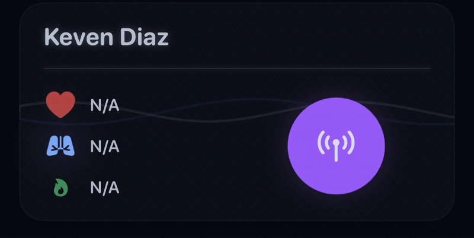
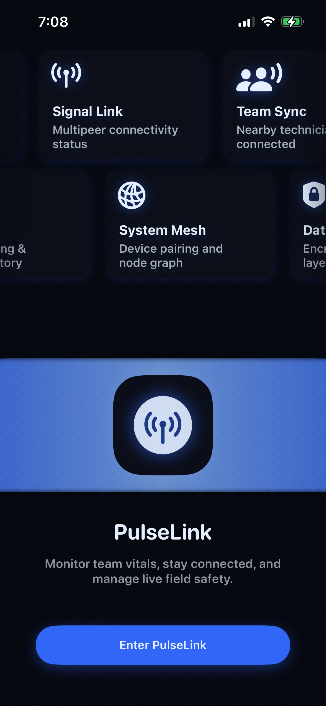
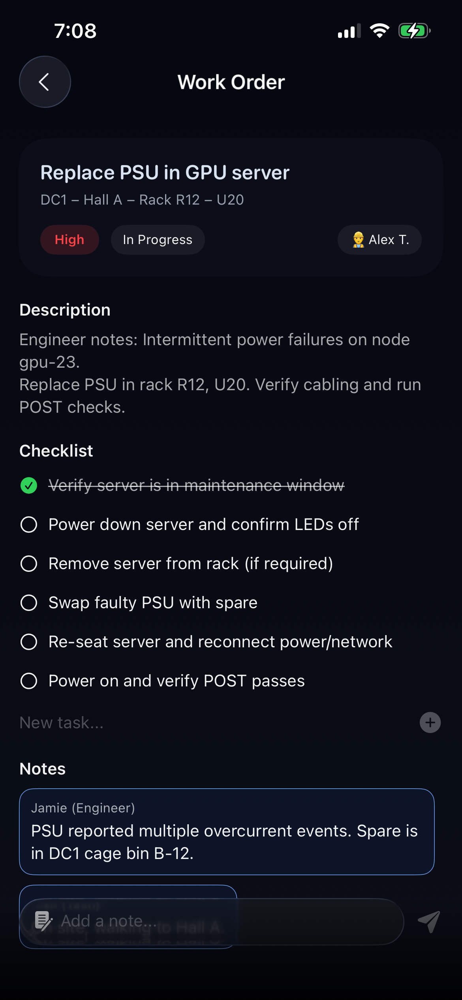
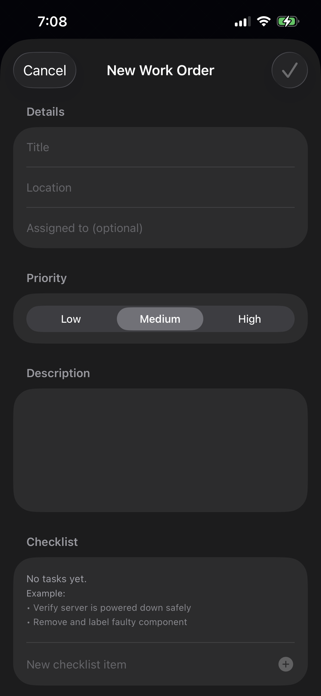
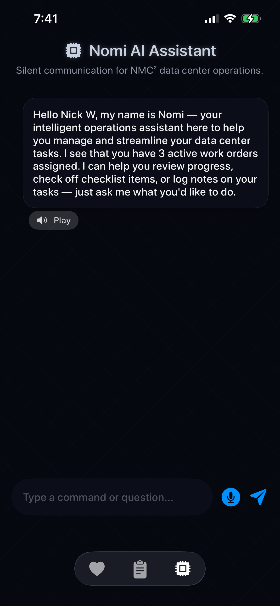

# ⚡️ PulseLink – Intelligent Health & Operations Network

> “Connecting people, devices, and data into one live ecosystem.”

---
## 🎥 Demo Previews

  
  

  
  
  
  

---

### 💡 Inspiration

In a high-stakes environment like **data centers**, where uptime equals millions of dollars and **human safety is critical**, there's often a disconnect between **human status** and **system status**.  

We wanted to bridge that gap — uniting **people, devices, and data** into a single, live ecosystem.

---

### 🚀 What PulseLink Does

**PulseLink** connects technicians across the Apple ecosystem — iPhone, Apple Watch, iPad, Mac, and Vision Pro — continuously sharing live vitals (❤️ heart rate, 🫁 oxygen, 🔥 energy) from your **Apple Watch** or **AirPods Pro Gen 3** via Apple’s secure `MultipeerConnectivity` network.

But PulseLink goes **far beyond health**:

- 🧾 **Integrated Ticket Management System**  
  Log incidents, track maintenance, and manage priority tasks — all without switching tools.

- 🤖 **Built-in Gemini-Powered LLM**  
  Answer complex hardware issues, suggest troubleshooting steps, or guide you through emergencies.

- 🌐 **Unified Operational Awareness**  
  From wrist to wall, every Apple device displays synchronized, real-time team and system data.

---

### 🧠 How We Built It

- **watchOS:** Streams real-time vitals using `HealthKit` + `WatchConnectivity`.  
- **iOS:** Acts as the network hub — receiving and broadcasting vitals via `MultipeerConnectivity`.  
  Also hosts the ticketing system for data-center technicians, built in **SwiftUI** and powered by **Gemini API** calls.  
- **iPad & macOS:** Provide large-format dashboards showing all active technicians and metrics — synchronized with iOS.  
- **visionOS:** Extends the dashboard into an immersive, spatial 3D control room for maximum operational awareness.  

---

### ⚙️ Tech Stack

| Category | Tools & Frameworks |
|-----------|--------------------|
| **Language** | Swift, SwiftUI, Combine |
| **Connectivity** | MultipeerConnectivity, WatchConnectivity |
| **Health Data** | HealthKit |
| **AI** | Gemini LLM (via API integration) |
| **Design** | Neumorphic UI + CrossHatch backgrounds |
| **Platforms** | iOS · iPadOS · watchOS · macOS · visionOS |

---

### 💥 Challenges We Faced

- Building a **low-latency peer network** for real-time vitals sync — even with Apple’s frameworks, it’s tough under hackathon time pressure.  
- Managing **privacy and security** while transmitting sensitive health data.  
- Optimizing **UI layouts** for five Apple platforms with drastically different form factors.  
- And, of course — doing all this within **24 hours**.

---

### 🧭 What We Learned

- That we’re capable of building a full, multi-device ecosystem in under a day!  
- How to architect a **real-time, peer-to-peer network** across Apple platforms.  
- The **unseen challenges data-center technicians** experience every day.  
- How AI and health data together can redefine operational safety and efficiency.

---

© 2025 NMC-HackUTD
