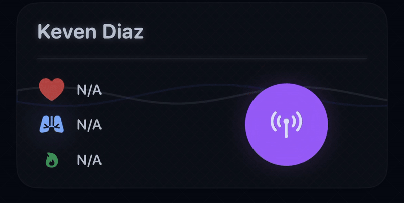
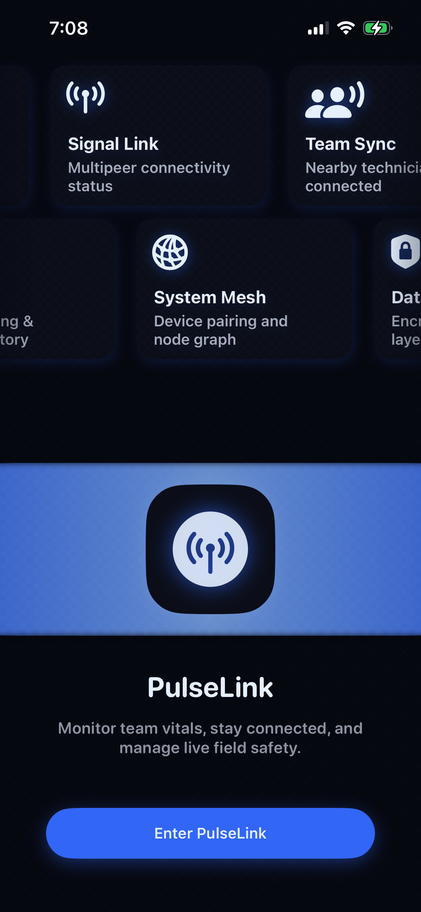
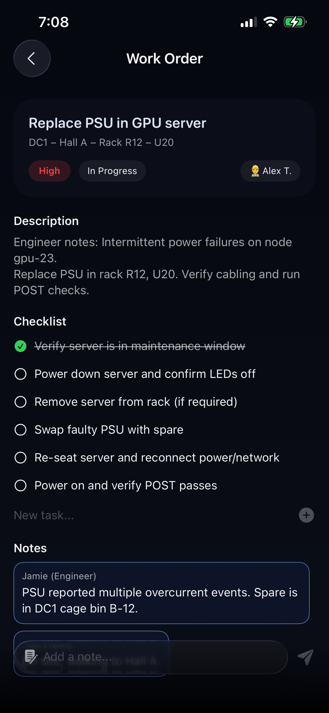
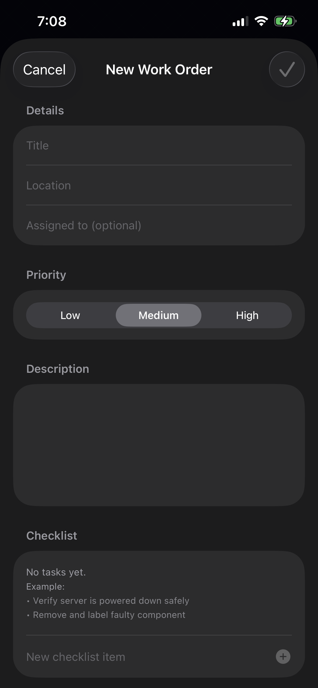
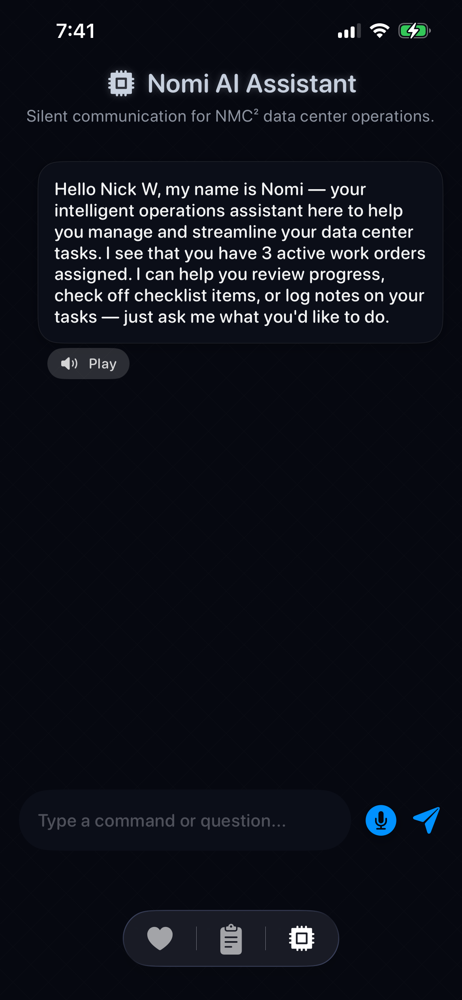

# PulseLink
### Intelligent Health & Operations Network

PulseLink is a multi-device Apple ecosystem application designed to integrate technician health monitoring with operational awareness in high-risk environments such as data centers.

The system connects Apple devices including Apple Watch, iPhone, iPad, Mac, and Apple Vision Pro to provide real-time biometric monitoring alongside operational task management and AI-assisted troubleshooting.

By combining health telemetry with infrastructure workflows, PulseLink creates a unified operational environment where both technician wellbeing and system status can be monitored simultaneously.

---

## Demo

  
  

  
  
  
  

---

## Overview

In data center environments, system monitoring tools track infrastructure health, but rarely account for the physical condition of the technicians maintaining that infrastructure.

PulseLink bridges this gap by integrating live biometric data with operational workflows. Technicians can be monitored in real time while simultaneously managing maintenance tasks and responding to incidents.

The result is a shared operational interface that connects people, devices, and systems into a single real-time network.

---

## Features

### Real-Time Health Monitoring

PulseLink collects biometric data from Apple Watch and AirPods Pro (Gen 3), including heart rate, oxygen saturation, and energy metrics. Health data is transmitted securely between devices using Apple’s peer-to-peer networking frameworks.

### Integrated Work Order System

Technicians can create and manage maintenance tickets directly within the app. The work order interface allows teams to track incidents, assign priorities, and monitor active tasks without switching between tools.

### AI-Assisted Troubleshooting

The system integrates with the Gemini API to provide contextual troubleshooting assistance. Technicians can request explanations, diagnostic guidance, or recommended repair steps during incidents.

### Cross-Device Operational Dashboard

PulseLink synchronizes technician health data and operational metrics across devices. From a smartwatch interface to large dashboard displays, every device reflects the same real-time system state.

---

## Architecture

PulseLink uses a distributed architecture built on Apple platform frameworks.

### watchOS

Apple Watch collects biometric data through HealthKit and transmits updates to the paired iPhone using WatchConnectivity.

### iOS

The iPhone acts as the primary networking hub. It receives health telemetry from the watch and distributes the data across nearby devices using MultipeerConnectivity. The iOS application also hosts the work order management interface and AI integration.

### iPadOS and macOS

Tablet and desktop devices provide large-format dashboards displaying technician status, health metrics, and active maintenance tasks.

### visionOS

PulseLink extends the dashboard into a spatial computing environment, allowing operators to monitor technicians and system status in a 3D workspace.

---

## Technologies

| Category | Technologies |
|--------|--------------|
| Language | Swift |
| UI Framework | SwiftUI |
| Data Flow | Combine |
| Health Data | HealthKit |
| Connectivity | MultipeerConnectivity, WatchConnectivity |
| AI Integration | Gemini API |
| Platforms | iOS, iPadOS, watchOS, macOS, visionOS |

---

## Development

PulseLink was built during **HackUTD 2025** as a rapid prototype exploring how health telemetry and operational systems can be integrated across Apple devices.

The project demonstrates how Apple’s platform frameworks enable real-time distributed systems with minimal infrastructure.

---

## License

This project was developed for HackUTD and is intended as a prototype demonstration.

© 2025 NMC HackUTD
